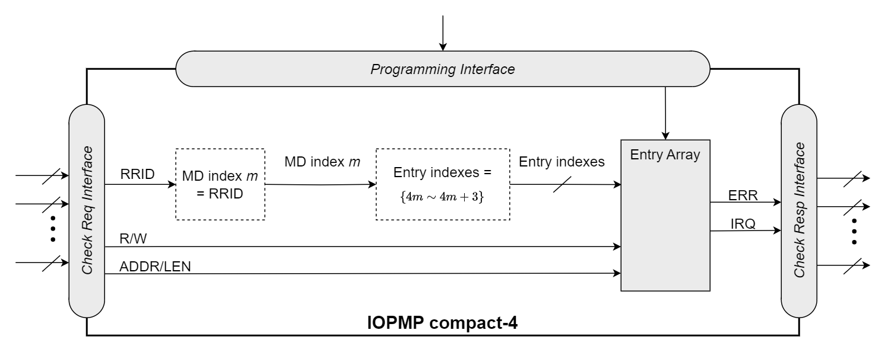

=== IOPMP Models
For the sake of convenience of discussion, some highly used combinations of *HWCFG0* have an alias name, which are *srcmd_fmt*=0 and *mdcfg_fmt*=0 as the full model, *srcmd_fmt*=0 and *mdcfg_fmt*=1 as the rapid-_k_ model, where _k_ = (*md_entry_num* + 1), *srcmd_fmt*=0 and *mdcfg_fmt*=2 as the dynamic-_k_ model, where _k_ = (*md_entry_num* + 1), *srcmd_fmt*=1 and *mdcfg_fmt*=0 as the isolation model, and *srcmd_fmt*=1 and *mdcfg_fmt*=1 as the compact-_k_ model, where _k_ = (*md_entry_num* + 1).

.an example block diagram of the rapid-4 model. The flow is the same as in <<IOPMP_BLOCK_DIAGRAM>>, except the MDCFG Table is simplified to a constant mapping illustrated in the dashed box. In this example, every MD has exactly four entries.
ifdef::backend-pdf[]
image::application_note/images/iopmp_unit_block_diagram_rapid_4.png[]
endif::[]
ifndef::backend-pdf[]
image::images/iopmp_unit_block_diagram_rapid_4.png[]
endif::[]

.an example block diagram of the compact-4 model.
ifdef::backend-pdf[]
image::application_note/images/iopmp_unit_block_diagram_compact_4.png[]
endif::[]
ifndef::backend-pdf[]

endif::[]

.an example block diagram of SRCMD Format 2. It illustrates the implementation of SRCMD Table Format 2 and MDCFG Table Format 1, where HWCFG0.md_entry_num is set to 0. In this example, each MD contains a single entry, meaning the entry index corresponds directly to the MD index.
ifdef::backend-pdf[]
image::application_note/images/iopmp_unit_block_diagram_srcmd_fmt2.png[]
endif::[]
ifndef::backend-pdf[]

endif::[]