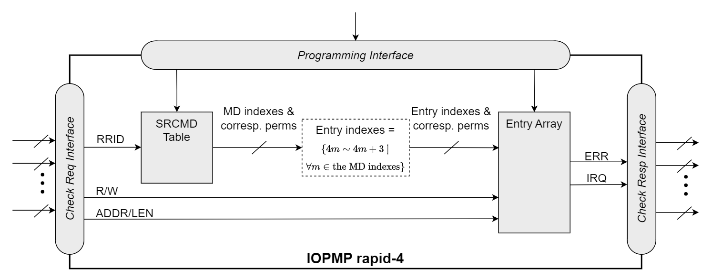

=== IOPMP Implementation Models

The IOPMP specification supports multiple implementation models that combine different SRCMD Table and MDCFG Table formats to address specific system requirements. These models provide convenient reference configurations for common use cases, enabling designers to select appropriate trade-offs between hardware complexity, flexibility, and performance.

==== Full Model

*Configuration*: *srcmd_fmt*=0, *mdcfg_fmt*=0

The Full Model is the default IOPMP configuration with complete SRCMD and MDCFG Table implementations, providing maximum flexibility and supporting all IOPMP extensions. This serves as the baseline for comparison with other optimized models.

==== Rapid-_k_ Model

*Configuration*: *srcmd_fmt*=0, *mdcfg_fmt*=1, where _k_ = (*md_entry_num* + 1)

The Rapid-k Model simplifies MDCFG Table lookup by implementing a fixed entry allocation scheme where each memory domain contains exactly _k_ entries. This eliminates the need for MDCFG Table lookups, reducing access latency and hardware complexity while maintaining full SRCMD Table flexibility.

*Characteristics*:
* Full SRCMD Table with arbitrary RRID-to-MD associations
* Simplified MDCFG with constant _k_ entries per MD
* Direct calculation: entry index = MD index × _k_ + offset
* Reduced MDCFG lookup latency
* Supports SPS extension

*Use cases*: Systems with uniform memory region sizes, real-time systems requiring predictable access latency, applications with regular memory partitioning.

.Block diagram of the Rapid-4 model implementation. The MDCFG Table is simplified to a constant mapping where each memory domain contains exactly four entries.
ifdef::backend-pdf[]
image::application_note/images/iopmp_unit_block_diagram_rapid_4.png[]
endif::[]
ifndef::backend-pdf[]

endif::[]

==== Dynamic-_k_ Model

*Configuration*: *srcmd_fmt*=0, *mdcfg_fmt*=2, where _k_ = (*md_entry_num* + 1)

The Dynamic-k Model provides runtime-programmable entry allocation similar to the Full Model but with a different MDCFG Table format. This format enables efficient dynamic reconfiguration of memory domain boundaries while maintaining full SRCMD Table capabilities.

*Characteristics*:

* Full SRCMD Table with arbitrary RRID-to-MD associations
* Alternative MDCFG Table format for dynamic configuration
* Runtime-programmable memory domain boundaries
* Supports SPS extension
* Optimized for dynamic memory management

*Use cases*: Systems requiring frequent memory domain reconfiguration, dynamic resource allocation scenarios, adaptive protection schemes.

==== Isolation Model

*Configuration*: *srcmd_fmt*=1, *mdcfg_fmt*=0

The Isolation Model implements direct RRID-to-MD mapping where RRID _i_ exclusively associates with memory domain _i_. This provides strong isolation between requestors while maintaining flexible entry allocation through the full MDCFG Table. The model eliminates SRCMD Table hardware entirely, achieving significant area savings.

*Characteristics*:
* Direct RRID-to-MD mapping (RRID _i_ → MD _i_)
* No physical SRCMD Table implementation
* Full MDCFG Table with flexible entry allocation
* Supports up to 63 RRIDs
* Strong requestor isolation
* SPS extension not supported

*Use cases*: Embedded systems with isolated functional units, systems prioritizing strong isolation over shared resources, source-enforcement scenarios.

==== Compact-_k_ Model

*Configuration*: *srcmd_fmt*=1, *mdcfg_fmt*=1, where _k_ = (*md_entry_num* + 1)

The Compact-k Model maximizes area efficiency by combining both SRCMD and MDCFG simplifications. It implements direct RRID-to-MD mapping with fixed _k_ entries per memory domain, eliminating both table lookup mechanisms. This represents the most area-optimized IOPMP configuration.

*Characteristics*:
* Direct RRID-to-MD mapping (RRID _i_ → MD _i_)
* Fixed _k_ entries per MD with constant allocation
* No SRCMD Table implementation
* Simplified MDCFG with constant entry allocation
* Minimum hardware resource utilization
* Direct calculation: entry index = RRID × _k_ + offset
* SPS extension not supported

*Use cases*: Resource-constrained embedded systems, cost-sensitive applications, simple protection scenarios with isolated requestors and uniform memory regions.

.Block diagram of the Compact-4 model implementation, combining SRCMD Format 1 and MDCFG Format 1 for maximum area efficiency.
ifdef::backend-pdf[]
image::application_note/images/iopmp_unit_block_diagram_compact_4.png[]
endif::[]
ifndef::backend-pdf[]
image::images/iopmp_unit_block_diagram_compact_4.png[]
endif::[]

These models serve as implementation guidelines, allowing system designers to choose configurations that best match their area constraints, performance requirements, and protection granularity needs. The selection involves trade-offs between hardware complexity, flexibility, isolation strength, and configuration overhead.