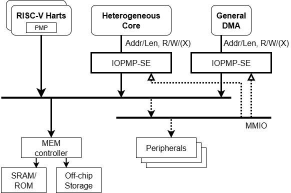

=== SRCMD Table Reduction

The IOPMP specification provides SRCMD Table reduction strategies to minimize hardware resource utilization in systems with simplified access control requirements. These strategies enable area-efficient implementations by reducing or eliminating SRCMD Table lookups while maintaining essential protection functionality.

==== Source-Enforcement

Systems with requestors that already implement firewall mechanisms, such as RISC-V harts with Physical Memory Protection (PMP), can optimize IOPMP implementation by applying rule checking selectively. This approach, known as source-enforcement (IOPMP-SE), enables significant area savings and design simplification when protection is needed only for a subset of requestors.

Source-enforcement is particularly beneficial in heterogeneous systems where some requestors possess their own protection mechanisms while others, such as DMA engines or specialized accelerators, require external protection. By configuring the IOPMP to enforce rules only for unprotected requestors, implementations can achieve substantial hardware resource reduction without compromising system security.

[#IOPMP_SE_Example]
.Example implementation of source-enforcement where RISC-V harts use PMP while heterogeneous cores and DMA rely on IOPMP-SE.

==== SRCMD Table Format 1

IOPMP-SE is realized through SRCMD Table Format 1, which implements a direct mapping where RRID _i_ associates exclusively with memory domain _i_. This one-to-one mapping eliminates the need for SRCMD Table lookups, providing benefits in area efficiency, access latency reduction, and implementation complexity. The format supports scenarios with a single requestor or multiple requestors requiring identical access permissions.

Format 1 is particularly effective for embedded systems and resource-constrained environments where minimizing hardware overhead is critical. The format supports up to 63 RRIDs and eliminates the physical SRCMD Table implementation entirely. However, designers should note that shared memory regions require duplicated entry settings in this format, which may impact configuration flexibility in systems with extensive resource sharing requirements.

The SRCMD Table format is discovered through the *HWCFG2.srcmd_fmt* field.

[#HWCFG2]
[cols="<2,<1,<1,<1,<6"]
|===
5+h|HWCFG2{set:cellbgcolor:#D3D3D3}
5+h|0x0008
h|Field                         |Bits   |R/W    |Default    |Description
|{set:cellbgcolor:#FFFFFF}srcmd_fmt                      |3:2    |R      |IMP        |Indicates the SRCMD Table format:

* 0x0: Format 0 (default) - Standard SRCMD Table implementation

* 0x1: Format 1 - No SRCMD Table required    

* 0x2: Format 2 - *SRCMD_PERM(_m_)* and *SRCMD_PERMH(_m_)* registers available

* 0x3: Reserved

|===