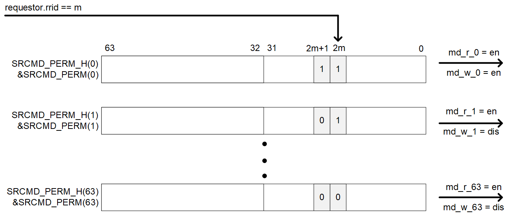

[#srcmd-table-formats]
=== SRCMD Table Reduction

The IOPMP specification provides SRCMD Table reduction strategies to minimize hardware resource utilization in systems with simplified access control requirements. These strategies enable area-efficient implementations by reducing or eliminating SRCMD Table lookups while maintaining essential protection functionality.

==== Source-Enforcement

Systems with requestors that already implement firewall mechanisms, such as RISC-V harts with Physical Memory Protection (PMP), can optimize IOPMP implementation by applying rule checking selectively. This approach, known as source-enforcement (IOPMP-SE), enables significant area savings and design simplification when protection is needed only for a subset of requestors.

Source-enforcement is particularly beneficial in heterogeneous systems where some requestors possess their own protection mechanisms while others, such as DMA engines or specialized accelerators, require external protection. By configuring the IOPMP to enforce rules only for unprotected requestors, implementations can achieve substantial hardware resource reduction without compromising system security.

[#IOPMP_SE_Example]
.Example implementation of source-enforcement where RISC-V harts use PMP while heterogeneous cores and DMA rely on IOPMP-SE.
ifndef::backend-pdf[]
image::../images/IOPMP_SE.drawio.png[]
endif::[]
ifdef::backend-pdf[]
image::./images/IOPMP_SE.drawio.png[]
endif::[]

==== SRCMD Table in the Exclusive Format

Exclusive Format implements a direct mapping where RRID _i_ associates exclusively with memory domain _i_. This one-to-one mapping eliminates the need for SRCMD Table lookups, providing benefits in area efficiency, access latency reduction, and implementation complexity. The format supports scenarios with a single requestor or multiple requestors requiring identical access permissions.

Exclusive Format is particularly effective for embedded systems and resource-constrained environments where minimizing hardware overhead is critical. The format supports up to 63 RRIDs and eliminates the physical SRCMD Table implementation entirely. However, designers should note that shared memory regions require duplicated entry settings in this format, which may impact configuration flexibility in systems with extensive resource sharing requirements.

The SRCMD Table format is discovered through the *HWCFG3.srcmd_fmt* field.
*HWCFG3.srcmd_fmt* = 1 indicates the SRCMD Table format is Exclusive Format.

==== SRCMD Table in the MD-indexed Format
MD-indexed Format implements a physical SRCMD Table array similar to the baseline SRCMD Table, but indexed by memory domain rather than RRID. For memory domain _m_, registers *SRCMD_PERM(_m_)* and *SRCMD_PERMH(_m_)* are implemented at the same addresses as *SRCMD_EN(_s_)* and *SRCMD_ENH(_s_)* in the baseline format. This format allows per-RRID permission configuration for each memory domain, outputting permissions for every memory domain based on the requesting RRID. MD-indexed Format supports up to 32 RRIDs. The SPS extension is not supported in this format.

[#Example_Format_2]
.An example block diagram of SRCMD Table MD-indexed Format Implementation.
ifdef::backend-pdf[]
image::./images/srcmd_format2_example.png[]
endif::[]
ifndef::backend-pdf[]

endif::[]

*SRCMD_PERM(_m_)* and *SRCMD_PERMH(_m_)* are available when *HWCFG3.srcmd_fmt* = 2.
In MD-indexed Format, an IOPMP checks both the permission of *SRCMD_PERM(H)(_m_)* and the *ENTRY_CFG.r/w/x* permission. A transaction is legal if either of them allows the transaction.
