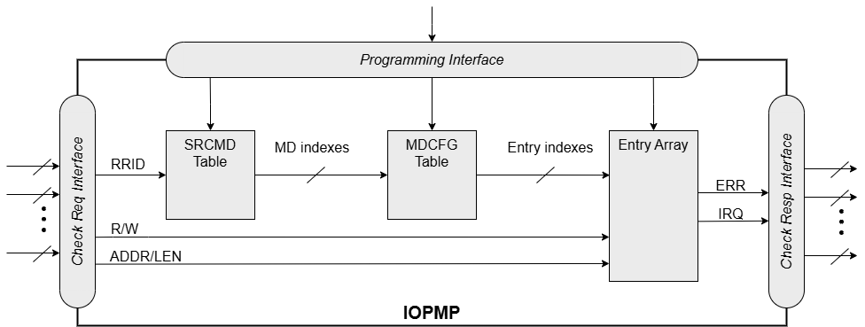

[[Concepts]]
== Terminology and Concepts

This document refers to the term “secure monitor” as the software responsible for managing security-related tasks, including the programming of IOPMPs. The secure monitor is not restricted to operating on a single CPU or hart; instead, it may be distributed across multiple CPUs.

.Glossary and Acronyms
[%autowidth, cols="<1,<3", options="header"]
|===
|Term |Description
|AMO| atomic memory operation
|DC| don't care
|ID| identifier
|IMP|implementation-dependent
|IMSIC| Incoming Message-Signaled Interrupt Controller, defined in the RISC-V advanced interrupt architecture (AIA) cite:[AIA] specification
|IOMMU| Input-Output Memory Management Unit, a RISC-V non-ISA specification
|MD| memory domain
|MMIO|memory mapped input/output devices
|MSI| message-signaled interrupts
|NA4|naturally aligned four-byte region, one of the address matching mode used in RISC-V PMP cite:[PrivISA] and IOPMP
|NAPOT|naturally aligned power-of-2 region, one of the address matching mode used in RISC-V PMP cite:[PrivISA] and IOPMP
|N/A| not available
|ROM| read-only memory
|RRID| Request Role ID
|RX|receiver
|SPS| secondary permission setting, an extension of RISC-V IOPMP
|TOR|top boundary of an arbitrary range, one of the address matching mode used in RISC-V PMP cite:[PrivISA] and IOPMP
|TX|transmitter
|WARL|write any read legal, a behavior of fields
|W1C|write '1' clear, a behavior of single bit fields
|W1CS|write '1' clear and sticky to 0, a behavior of single bit fields: writing '1' clears the bit. If the bit is cleared, this state remains fixed until IOPMP registers are reset.
|W1S|write '1' set, a behavior of single bit fields
|W1SS|write '1' set and sticky to 1, a behavior of single bit fields: writing '1' sets the bit. If the bit is set, this state remains fixed until IOPMP registers are reset.
|X( _n_ )|the _n_-th register in the register array X, which starts from 0.
|X[ _n_ ]|the _n_-th bit of a register X or register field X
|X( _n_ : _m_ )|the _n_-th to _m_-th registers of a register X.
|X[ _n_ : _m_ ]|the _n_-th to _m_-th bits of a register X or register field X.
|===

=== Request-Role-ID and Transaction
Request Role ID, RRID for short, is a unique ID to identify a system-defined security context. For example, a unique RRID can be a transaction requestor or a group of transaction requestors with the same permission. Depending on the IOPMP integration, transactions may be tagged with an RRID to identify the requestor. Tagging requestors with RRID is implementation-dependent. The number of bits of an RRID is implementation-dependent as well. If different channels or modes of a requestor could be granted different access permissions, they can have their own RRID.

=== Source-Enforcement
If all transactions going through the IOPMP are issued by the same transaction requestor or a set of transaction requestors with the same permission, the RRID can be ignored on the transaction requestor side and the above transactions. In the case, we denote the IOPMP performs source enforcement, IOPMP-SE for short.

=== Requestor Port, Receiver Port and Control Port
An IOPMP has one or multiple requestor ports, one or multiple receiver ports and one control port. A receiver port is where a transaction goes into the IOPMP, and a requestor port is where a transaction leaves it if the transaction passes all the checks. The control port is used to program the IOPMP.

=== Memory Domain
An RRID is an abstract representation of a transaction requestor. It encompasses one or more transaction requestors that are granted identical permissions. A memory domain, MD for short, is an abstract representation of a transaction destination that groups a set of memory regions for a specific purpose. MDs are indexed from zero. For example, a network interface controller, NIC, may have three memory regions: an RX region, a TX region, and a region of control registers. We could group them into one MD. If a processor can fully control the NIC, the processor can be associated with the MD.

It’s important to note that, generally speaking, a single RRID can be associated with multiple memory domains (MDs), and a MD can be associated with multiple RRIDs. SRCMD Table is a one of fundamental structures in IOPMP to indicate associations between RRIDs and MDs, which will be introduced in <<#SECTION_3_2, SRCMD Table Formats>>.

MDCFG Table also is one of fundamental structures in IOPMP to define a set of memory regions in a MD, which will be introduced in <<#SECTION_3_3, MCDFG Table Formats>>. An IOPMP entry defines a single memory region, which will be introduced in <<#SECTION_2_5, IOPMP Entry and IOPMP Entry Array>>. 

An RRID associated with a MD may not have full permissions on all memory regions of the MD, because the permission of each region is defined in the corresponding IOPMP entry. Additionally, some specific configurations of SRCMD Table can define the permission to a whole MD in SRCMD Table that will be introduced in <<#SECTION_3_2_3, SRCMD Table Format 2>> and <<#APPENDIX_A3, Appendix A3. Secondary Permission Setting>>.

Certain configurations of SRCMD Table and MDCFG Table may impose restrictions on this flexibility, which will be discussed in <<#IOPMP_Tables_and_Configuration_Protection, Chapter 3. IOPMP Tables and Configuration Protection>>.

[#SECTION_2_5]
=== IOPMP Entry and IOPMP Entry Array
The IOPMP entry array, contains *HWCFG1.entry_num* IOPMP entries. Each entry, starting from an index of zero, includes a specified memory region, the corresponding permissions, and optional features about error reactions and user customized attributes.

For an entry indexed by _i_, *ENTRY_ADDR(_i_)*, *ENTRY_ADDRH(_i_)* and *ENTRY_CFG(_i_).a* encode the memory region in the same way as the RISC-V PMP. *ENTRY_ADDR(_i_)* and *ENTRY_ADDRH(_i_)* are the encoded address for the IOPMP with addresses greater than 34 bits. For addresses less than and equal to 34 bits, only *ENTRY_ADDR(_i_)* is in use. To determine whether *ENTRY_ADDRH(_i_)* are implemented, one can check *HWCFG0.addrh_en*. Please refer <<#HWCFG0, HWCFG0>> for more details of *HWCFG0.addrh_en*. *ENTRY_CFG(_i_).a* is the address mode, which are OFF, NA4, NAPOT, and TOR. Please refer to the RISC-V privileged spec cite:[PrivISA] for the details of the encoding schemes. *HWCFG0.tor_en* = 1 indicates the IOPMP supports TOR address mode.

[NOTE]
====
Since the address encoding scheme of TOR refers to the previous entry's memory region, which is not in the same memory domain, it would cause unexpected results. If the first entry of a memory domain selects TOR, the entry refers to the previous memory domain. When the previous memory domain is changed unexpectedly, the region of this entry will be altered. To prevent the unexpected change of memory region, software should

* avoid adopting TOR for the first entry of a memory domain; or 
* set an OFF for the last entry of a memory domain with the maximal address during programming the IOPMP.
====

*ENTRY_CFG(_i_).r/w/x* indicate the read access, write access and instruction fetch permission and they are WARL. That is, an implementation can decide which bits are programmable or hardwired and which bit combinations are unwanted. An IOPMP can differentiate between read and instruction fetch accesses when *HWCFG0.chk_x* is 1.

*ENTRY_CFG(_i_)* also contains optional WARL fields: *sire*, *siwe*, *sixe*, *esre*, *eswe*, and *esxe*. These fields are used to control error reactions per entry, such as interrupt triggering and bus error responses. The detailed usages will be introduced in <<#SECTION_2_7, Error Reactions>>.

The optional register *ENTRY_USER_CFG(_i_)* stores customized attributes for an entry. To determine whether the register is implemented, one can check *HWCFG0.user_cfg_en*.

Any entry with index &#8805; *HWCFG1.entry_num* is not available. That is,

* Registers of the entry are not implemented.
* Address mode of the entry is treated as OFF when the IOPMP retrieves the entry in permission checks.

Memory domains are a way of dividing the IOPMP entry array into different subarrays. Each subarray is a memory domain. Each IOPMP entry can belong to at most one memory domain, while a memory domain could have multiple IOPMP entries. 

[NOTE]
====
A memory domain may have an IOPMP entry with index &#8805; *HWCFG1.entry_num* due to its register encoding or implementation. The entry is not available.
====

When an RRID is associated with a memory domain, it is also inherently associated with all the entries that belong to that memory domain.

[#SECTION_2_6]
=== Priority and Matching Logic
There are two read-only bits, *HWCFG0.no_w* and *HWCFG0.no_x*, used to decide whether the IOPMP denies any write transaction and any instruction fetch, respectively. An IOPMP always fails a write transaction when *HWCFG0.no_w* is 1, and fails instruction fetch transaction when *HWCFG0.no_x* is 1. The error type is "not hit any rule" (0x05).

NOTE: *HWCFG0.no_w* and *HWCFG0.no_x* can simply implementations by reducing programmable permission bits and possibly reducing operations during retrieving entries when an implementation is designed for specific memory regions. For example, an implementation with *no_w* = 1 denies any write transactions for Flash memory regions and ROM regions. Similarly, an implementation with *no_x* = 1 denies instruction fetches for data-only regions.

When a transaction arrives at an IOPMP, the IOPMP first checks whether the RRID carried by the transaction is legal. If the RRID is illegal, the transaction is illegal with error type = "Unknown RRID" (0x06)".

NOTE: Whether an RRID is legal is implementation-dependent, even though it < *HWCFG1.rrid_num*.

IOPMP entries are partially prioritized. Entries identified by indices less than the value defined in HWCFG2.prio_entry are prioritized according to their respective index values. Specifically, entries with lower indices are assigned a higher priority. These entries are referred to as priority entries. Conversely, entries with indices greater than or equal to *prio_entry* are treated equally and assigned the lowest priority. These entries are referred to as non-prioritized entries. The value of *prio_entry* is implementation-dependent. Additionally, *HWCFG0.prient_prog* indicates if *prio_entry* is programmable. 

NOTE: The specification incorporates both priority and non-priority entries due to considerations of security, latency, and area. Priority entries, which are locked, safeguard the most sensitive data, even in the event of secure software being compromised. However, implementing a large number of these priority entries results in higher latency and increased area usage. On the other hand, non-priority entries are treated equally and can be cached in smaller numbers. This approach reduces the amortized latency, power consumption, and area when the locality is sufficiently high. Thus, the mix of entry types in the specification allows for a balance between security and performance.

An entry qualifies as a matching entry for an incoming transaction if:

* For priority entries, its region covers any byte of the transaction,
* For non-priority entries, its region covers all bytes of the transaction,
* It is associated with the RRID carried by the transaction; and
* It holds the highest priority among entries that meet the previous criteria.

[NOTE]
====
Multiple matching entries are allowed for non-priority entries because they share the lowest priority.
====

Matched entries can grant a transaction according to its access type. If any matched entry allows the access type, the transaction is legal. Every entry can permit read, write, and instruction fetch of a transaction by its *r*, *w*, and *x* bits, respectively.
An IOPMP can carry the optional permission from SRCMD Table to IOPMP entry array for the corresponding memory domain if it supports <<#SECTION_3_2_3, SRCMD Table Format 2>> or <<#APPENDIX_A3, SPS extension>>.

If the matching entry is priority entry, the matching entry must match all bytes of a transaction, or the transaction is illegal with error type = "partial hit on a priority rule" (0x04), irrespective of its permission. If a priority entry is matched but doesn't grant transaction permission to operate, the transaction is illegal with error type = "illegal read access" (0x01) for read access transaction, "illegal write access/AMO" (0x02) for write access/atomic memory operation (AMO) transaction, or "illegal instruction fetch" (0x03) for instruction fetch transaction.

[NOTE]
====
To grant an AMO transaction permission, entries and/or memory domains must have read access permission and write access permission.
====

[NOTE]
====
Some AMO implementations of I/O agents are using a non-atomic read-modify-write sequence which could contain a read access transaction and a write access transaction, not single AMO transaction. Therefore, IOPMP possiblly captures error type = "illegal read access" (0x01) when read permission for the read-modify-write sequence from the I/O agents is not granted.
====

If one matching entry is non-priority, the transaction is legal if any matching entry permits its access type. If no matching entry permits, the transaction is illegal with error type = "illegal read access" (0x01) for read access transaction, "illegal write access/AMO" (0x02) for write access/AMO transaction, or "illegal instruction fetch" (0x03) for instruction fetch transaction.

Finally, if no matching entry exists, the transaction is illegal with error type = "not hit any rule" (0x05).

[#IOPMP_BLOCK_DIAGRAM]
.an example block diagram of an IOPMP. It illustrates the checking flow of an IOPMP. This IOPMP takes three inputs: RRID, the transaction type (read/write), and the request range (address/len). It first looks up the SRCMD Table according to the RRID carried by the incoming transaction to retrieve associated MD indexes and the corresponding permissions related to these MDs. By the MD indexes, the IOPMP looks up the MDCFG Table to get the belonging entry indexes. The final step checks the access right according to the above entry indexes and corresponding permissions. An interrupt, an error response, and/or a record is generated once the transaction fails the permission check in the step.

[#SECTION_2_7]
=== Error Reactions
Upon detecting an illegal transaction, the IOPMP could initiate three of the following actions: 

* Trigger an interrupt to notify the system of the violation.

* Return bus error (or a decode error) or not with an implementation-defined value. 

* Log the error details in IOPMP error record registers.

IOPMP can trigger an interrupt on an access violation. *ERR_CFG* register configures the interrupt globally, while every entry has local fields to configure interrupt behavior locally. The *ERR_CFG.ie* bit serves as the global interrupt enable configuration bit. Every entry _i_ has three optional interrupt suppression bits in register *ENTRY_CFG(_i_)*, *sire*, *siwe*, and *sixe* to suppress interrupt triggering due to illegal reads, illegal writes, and illegal instruction fetches, respectively. 
*HWCFG0.peis* is 1 if an implementation supports *sire*, *siwe*, or *sixe*. The interrupt pending indication is equivalent to the error valid indication; both are flagged through the *ERR_INFO.v* bit. On an illegal transaction with error type = "illegal read access" (0x01), "illegal write access/AMO" (0x02), or "illegal instruction fetch" (0x03), an interrupt is triggered if the global interrupt is enabled (*ie*) and not suppressed (*sire*, *siwe*, or *sixe*) by all matching entries. For *peis* is 0, *sire*, *siwe*, and *sixe* should be wired to 0. On an illegal transaction with other types, an IOPMP triggers an interrupt only when *ie*=1. Considering Entry _i_ matches an illegal transaction, the condition for the interrupt for each type of illegal access can be described as follows: 

* Illegal read access (0x01): +
*ERR_CFG.ie* && !*ENTRY_CFG(_i_).sire* 
* Illegal write access/AMO (0x02): +
*ERR_CFG.ie* && !*ENTRY_CFG(_i_).siwe*
* Illegal instruction fetch (0x03): +
*ERR_CFG.ie* && !*ENTRY_CFG(_i_).sixe*

For the cases with multiple matched non-priority entries indexed by _i_~0~, _i_~1~, …​, _i~N~_ , the condition is:

* Illegal read access (0x01): +
*ERR_CFG.ie* && ( !*ENTRY_CFG(_i_~0~).sire* || !*ENTRY_CFG(_i_~1~).sire* || ... || !*ENTRY_CFG(_i~N~_).sire* )
* Illegal write access/AMO (0x02): +
*ERR_CFG.ie* && ( !*ENTRY_CFG(_i_~0~).siwe* || !*ENTRY_CFG(_i_~1~).siwe* || ... || !*ENTRY_CFG(_i~N~_).siwe* )
* Illegal instruction fetch (0x03): +
*ERR_CFG.ie* && ( !*ENTRY_CFG(_i_~0~).sixe* || !*ENTRY_CFG(_i_~1~).sixe* || ... || !*ENTRY_CFG(_i~N~_).sixe* )

NOTE: The local interrupt control mechanism can be beneficial in scenarios such as configuring guard regions that a prefetch may incidentally access but should not access. Suppressing such interrupts can reduce the unnecessary burden of unwanted interruptions.

Transactions that violate the IOPMP rule will by default yield a bus error. Additionally, the bus error response behavior on an IOPMP violation can be optionally configured globally via *ERR_CFG* register or locally through each *ENTRY_CFG* register. The IOPMP will signal the bus to the presence of a violation but will suppress the bus error if *ERR_CFG.rs* is implemented and set to 1 on a violation.  User-defined suppression behavior allows, for example, a read response of 0x0.  Likewise, the bus error response on an illegal write or instruction fetch. 

In the same way, the bus error response behavior can be set up globally and individually for each IOPMP entry. *ERR_CFG.rs* globally suppresses returning a bus error on illegal access. When global suppression is disabled, individual per-entry suppression is possible using *sere*, *sewe*, and *sexe* for illegal read, illegal write, and illegal instruction fetch, respectively. *HWCFG0.pees* is 1 if an IOPMP implements *sere*, *sewe*, and *sexe*. An IOPMP will respond with a bus error when a transaction is illegal and the bus error is not suppressed. Bus error response behavior of an IOPMP is controlled by global bus error response suppression configuration bit *rs* and suppression bits (*sere*, *sewe*, or *sexe*) in entries if a transaction only violates permissions on entries and *pees* is 1. On the other hand, if a transaction doesn't only violate permissions on entries, bus error response behavior of an IOPMP is controlled only by bus error response suppression configuration bit *rs*. The permissions include permission bits in entries (*ENTRY_CFG(_i_).r/w/x*) and permission bits from SRCMD Table (please refer <<#SECTION_3_2, SRCMD Table Formats>> for the details) to corresponding entries. Considering Entry  _i_ matches an illegal transaction, the condition for a bus error response for each access type can be described as follows:  

* Illegal read access (0x01): +
!*ERR_CFG.rs* && !*ENTRY_CFG(_i_).sere* 
* Illegal write access/AMO (0x02): +
!*ERR_CFG.rs* && !*ENTRY_CFG(_i_).sewe*
* Illegal instruction fetch (0x03): +
!*ERR_CFG.rs* && !*ENTRY_CFG(_i_).sexe*

For the cases with multiple matched non-priority entries indexed by _i_~0~, _i_~1~, …​, _i~N~_ , the condition is:

* Illegal read access (0x01): + 
!*ERR_CFG.rs* && ( !*ENTRY_CFG(_i_~0~).sere* || !*ENTRY_CFG(_i_~1~).sere* || ... || !*ENTRY_CFG(_i~N~_).sere* )
* Illegal write access/AMO (0x02): +
!*ERR_CFG.rs* && ( !*ENTRY_CFG(_i_~0~).sewe* || !*ENTRY_CFG(_i_~1~).sewe* || ... || !*ENTRY_CFG(_i~N~_).sewe* )
* Illegal instruction fetch (0x03): +
!*ERR_CFG.rs* && ( !*ENTRY_CFG(_i_~0~).sexe* || !*ENTRY_CFG(_i_~1~).sexe* || ... || !*ENTRY_CFG(_i~N~_).sexe* )

The error capture record maintains the specifics of the first illegal access detected, except for the condition:

* no interrupt regarding the access is triggered, and
* no bus error is returned.

An error capture only occurs when there is no pending error, that is, *ERR_INFO.v* = ‘0’. If a pending error exists (*v* = ‘1’), the record will not be updated, even if a new illegal access is detected. In other words, *v*  indicates whether the content of the capture record is valid and should be intentionally cleared in order to capture subsequent illegal accesses. One can write 1 to the bit to clear it. The error capture record is optional. If it is not implemented, *v* should be wired to zero. One can implement the error capture record, but doesn't implement the error entry index record (*ERR_REQID.eid*). In this case, *eid* should be wired to 0xffff.

For an illegal transaction matching multiple non-priority entries, if the interrupt is triggered or the bus error response is returned, *ERR_REQID.eid* stores the index of any of them.

The following table shows the control types (global or local) for each error type if the per-entry control bits are implemented (*HWCFG0.peis* = 1 and/or *HWCFG0.pees* = 1):

.Error types and corresponding control bits
[%autowidth, cols="<1,<2,<5,<3", options="header"]
|===
3+| Error type  | Control bits
   |0x00        2+| No error                          | N/A
   |0x01        2+| Illegal read access               | Global^1.^ and local^2.^
   |0x02        2+| Illegal write access/AMO          | Global and local
   |0x03        2+| Illegal instruction fetch         | Global and local
   |0x04        2+| Partial hit on a priority rule    | Global
   |0x05          | Not hit any rule                
  a|* No entry matches all bytes of a transaction  
    * Receives a write access transaction when *HWCFG0.no_w* is 1
    * Receives an instruction fetch transaction when *HWCFG0.no_x* is 1
   | Global
   |0x06        2+| Unknown RRID                      | Global
   |0x07        2+| Error due to a stalled transaction. Please refer <<#FAULTING_STALLED_TRANSACTIONS, Faulting stalled transactions>>.
   | Global
   |0x08 ~ 0x0D 2+| N/A, reserved for future          | N/A
   |0x0E ~ 0x0F 2+| User-defined error                | Implementation-dependent
|===

^1.^ Bit *ie* or *rs* in *ERR_CFG*. It depends on which reaction (that is, interrupt or bus error response).

^2.^ Bits *sire*, *siwe*, *sixe*, *sere*, *sewe*, or *sexe* in *ENTRY_CFG(_i_)*. It depends on which reaction (that is, interrupt or bus error response) and which transaction type of the illegal transaction (that is, read access, write access or instruction fetch).
