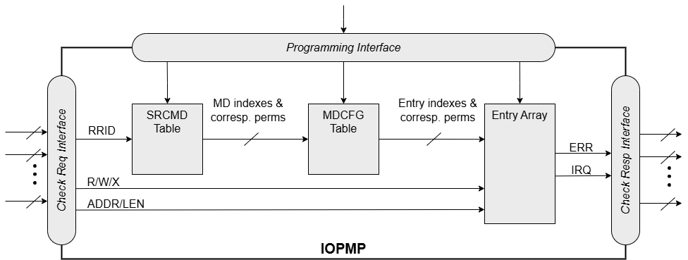

[#SPS_EXT]
=== Secondary Permission Setting (SPS)

This extension provides a mechanism to reduce the consumption of IOPMP entries in systems where multiple requestors (RRIDs) require different access permissions to the same shared memory regions.

Motivation: In the baseline specification, if RRID 'A' requires Read-Write (RW) access to a region and RRID 'B' requires Read-Only (RO) access to the exact same address range, two separate IOPMP entries must be configured (typically in two different Memory Domains). This consumes valuable Entry Array resources simply to define duplicate address ranges with different permissions.

The SPS extension addresses this by adding a second layer of permission checking within the SRCMD Table. This allows a single, shared IOPMP entry to define the address region with a superset of permissions (e.g., both read and write permissions are allowed), while the SPS registers (`SRCMD_R`/`SRCMD_W`/`SRCMD_RH`/`SRCMD_WH`) restrict the permissions for each RRID individually. This allows multiple RRIDs to share a single Memory Domain and its corresponding entries, significantly conserving the total number of entries required.

The field `HWCFG2.sps_en`=1 indicates that the extension is implemented.

When the SPS extension is implemented, each SRCMD Table entry additionally defines read and write permission registers: `SRCMD_R(_s_)` and `SRCMD_W(_s_)`, and `SRCMD_RH(_s_)` and `SRCMD_WH(_s_)` if applicable. Register `SRCMD_R(_s_)` and `SRCMD_W(_s_)` each has a single field, `SRCMD_R(_s_).md` and `SRCMD_W(_s_).md`, respectively representing the read and write permissions of memory domain 0 to 30 for requestor _s_.
Register `SRCMD_RH(_s_)` and `SRCMD_WH(_s_)` each has a single field, `SRCMD_RH(_s_).md` and `SRCMD_WH(_s_).mdh`, respectively representing the read and write permissions of memory domain 31 to 62 for requestor _s_.
Register `SRCMD_RH(_s_)` and `SRCMD_WH(_s_)` are implemented if `HWCFG0.md_num` > 31.

.An example block diagram of an IOPMP with the SPS extension. It illustrates the checking flow of an IOPMP with the SPS extension. The IOPMP first looks up the SRCMD Table according to the RRID carried by the incoming transaction to retrieve associated MD indexes and the corresponding permissions related to these MDs. By the MD indexes, the IOPMP looks up the MDCFG Table to get the belonging entry indexes. The final step checks the access right according to the above entry indexes and corresponding permissions.
ifdef::backend-pdf[]
image::./images/iopmp_unit_block_diagram_other_formats.png[]
endif::[]
ifndef::backend-pdf[]

endif::[]

The extension shares the same locks as `SRCMD_EN(_s_)` and `SRCMD_ENH(_s_)`. Setting lock to `SRCMD_EN(_s_).l` locks `SRCMD_R(_s_)`, `SRCMD_RH(_s_)`, `SRCMD_W(_s_)`, and `SRCMD_WH(_s_)`. `MDLCK.md[_m_]` locks `SRCMD_R(_s_).md[_m_]` and `SRCMD_W(_s_).md[_m_]` for all existing RRID _s_. `MDLCKH.mdh[_m_]` also locks `SRCMD_RH(_s_).mdh[_m_]` and `SRCMD_WH(_s_).mdh[_m_]` for all existing RRID _s_. `SRCMD_R(_s_)`, `SRCMD_RH(_s_)`, `SRCMD_W(_s_)`, and `SRCMD_WH(_s_)` can have prelocked bits fully or partially based on presets of `MDLCK.md`, `MDLCK.mdh`, and `SRCMD_EN.l`.

The extension has two sets of permission settings: one from IOPMP entry and the other from `SRCMD_R`/`SRCMD_W`/`SRCMD_RH`/`SRCMD_WH`. A transaction is legal only if it is permitted by both the SRCMD Table (SPS) permission and the matching entry's permission. A transaction fails the SPS check if it violates either of the permission settings. That is, the extension can only be used to restrict the permissions defined on an entry, not grant new permissions.

The instruction fetch permission on the SPS extension is considered the same as the read permission.

[cols="<2,<1,<1,<1,<6"]
|===
5+h|HWCFG2{set:cellbgcolor:#D3D3D3}
5+h|0x0008
h|Field                         |Bits   |R/W    |Default    |Description
|{set:cellbgcolor:#FFFFFF}
 `sps_en`                       |29:29  |R      |IMP        |Indicates secondary permission settings are supported; which are `SRCMD_R/RH(_s_)` and `SRCMD_W/WH(_s_)` registers, _s_ = 0 ... `HWCFG1.rrid_num` - 1.
|===

[cols="<2,<1,<1,<1,<6"]
|===
5+h|{set:cellbgcolor:#D3D3D3} SRCMD_R(_s_), _s_ = 0...`HWCFG1.rrid_num`-1
5+h|0x1008 + (_s_) × 32
h|Field                         |Bits       |R/W    |Default    |Description
|{set:cellbgcolor:#FFFFFF}
`rsv`                           |0:0        |ZERO   |0          |Must be zero on write, reserved for future.
|`md`                           |31:1       |WARL   |DC         |`md[_m_]` = 1 indicates RRID _s_ has read access and instruction fetch permission to the corresponding MD _m_. 
|===

[cols="<2,<1,<1,<1,<6"]
|===
5+h|{set:cellbgcolor:#D3D3D3} SRCMD_RH(s), _s_ = 0...`HWCFG1.rrid_num`-1
5+h|0x100C + (_s_) × 32
h|Field                         |Bits       |R/W    |Default    |Description
|{set:cellbgcolor:#FFFFFF}
`mdh`                           |31:0       |WARL   |DC         |`mdh[_m_]` = 1 indicates RRID _s_ has read access and instruction fetch permission to MD (_m_+31). 
|===

[cols="<2,<1,<1,<1,<6"]
|===
5+h|{set:cellbgcolor:#D3D3D3} SRCMD_W(_s_), _s_ = 0...`HWCFG1.rrid_num`-1
5+h|0x1010 + (_s_) × 32
h|Field                         |Bits       |R/W    |Default    |Description
|{set:cellbgcolor:#FFFFFF}
`rsv`                           |0:0        |ZERO   |0          |Must be zero on write, reserved for future.
|`md`                           |31:1       |WARL   |DC         |`md[_m_]` = 1 indicates RRID _s_ has write permission to the corresponding MD _m_. 
|===

[cols="<2,<1,<1,<1,<6"]
|===
5+h|{set:cellbgcolor:#D3D3D3} SRCMD_WH(_s_), _s_ = 0...`HWCFG1.rrid_num`-1
5+h|0x1014 + (_s_) × 32
h|Field                         |Bits       |R/W    |Default    |Description
|{set:cellbgcolor:#FFFFFF}
`mdh`                           |31:0       |WARL   |DC         |`mdh[_m_]` = 1 indicates RRID _s_ has write permission to MD (_m_+31). 
|===