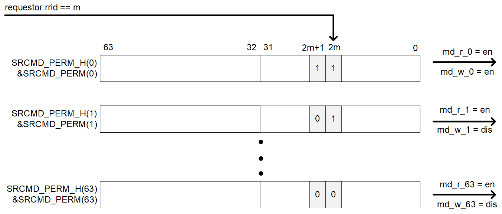

=== SRCMD Table Extensions

The IOPMP specification provides extensions to the baseline SRCMD Table implementation to support advanced use cases requiring flexible permission management. These extensions enable different RRIDs to have varying access permissions within shared memory domains or alternative table indexing schemes.

==== Secondary Permission Setting (SPS)

IOPMP/SPS (Secondary Permission Setting) is an extension that enables different transaction requestors to share memory domains while allowing each requestor to have different read, write, and instruction fetch permissions to a single memory domain. IOPMP/SPS is only supported when the SRCMD Table is in Format 0 (baseline), indicated by *HWCFG2.srcmd_fmt*=0. The field *HWCFG0.sps_en*=1 indicates that the IOPMP/SPS extension is implemented.

When IOPMP/SPS extension is implemented, each SRCMD Table entry additionally defines read and write permission registers: *SRCMD_R(_s_)* and *SRCMD_W(_s_)*, and *SRCMD_RH(_s_)* and *SRCMD_WH(_s_)* if applicable. Register *SRCMD_R(_s_)* and *SRCMD_W(_s_)* each has a single field, *SRCMD_R(_s_).md* and *SRCMD_W(_s_).md*, respectively representing the read and write permissions for each memory domain for requestor _s_.

IOPMP/SPS shares the same locks as *SRCMD_EN(_s_)* and *SRCMD_ENH(_s_)*. Setting lock to *SRCMD_EN(_s_).l* locks *SRCMD_R(_s_)*, *SRCMD_RH(_s_)*, *SRCMD_W(_s_)*, and *SRCMD_WH(_s_)*. *MDLCK.md[_m_]* locks *SRCMD_R(_s_).md[_m_]* and *SRCMD_W(_s_).md[_m_]* for all existing RRID _s_. *MDLCKH.mdh[_m_]* also locks *SRCMD_RH(_s_).mdh[_m_]* and *SRCMD_WH(_s_).mdh[_m_]* for all existing RRID _s_. *SRCMD_R*, *SRCMD_RH*, *SRCMD_W*, and *SRCMD_WH* can have prelocked bits fully or partially based on presets of *MDLCK.md*, *MDLCK.mdh*, and *SRCMD_EN.l*.

IOPMP/SPS has two sets of permission settings: one from IOPMP entry and the other from *SRCMD_R*/*SRCMD_W*. IOPMP/SPS shall check read and write permissions on both the SRCMD Table and entries. A transaction fails the IOPMP/SPS check if it violates either of the permission settings. That is, it can restrict the permissions defined on an entry according to requestors.

The instruction fetch permission on IOPMP/SPS is considered the same as the read permission.

[cols="<2,<1,<1,<1,<6"]
|===
5+h|{set:cellbgcolor:#D3D3D3} SRCMD_R(_s_), _s_ = 0...HWCFG1.rrid_num-1
5+h|0x1008 + (_s_)*32
h|Field                         |Bits       |R/W    |Default    |Description
|{set:cellbgcolor:#FFFFFF}rsv    |0:0       |ZERO   |0|Must be zero on write, reserved for future
|{set:cellbgcolor:#FFFFFF}md    |31:1       |WARL   |DC         | *md[_m_]* = 1 indicates RRID _s_ has read access and instruction fetch permission to the corresponding MD _m_. 
|===

[cols="<2,<1,<1,<1,<6"]
|===
5+h|{set:cellbgcolor:#D3D3D3} SRCMD_RH(s), _s_ = 0...HWCFG1.rrid_num-1
5+h|0x100C + (_s_)*32
h|Field                         |Bits       |R/W    |Default    |Description
|{set:cellbgcolor:#FFFFFF}mdh   |31:0       |WARL   |DC         | *mdh[_m_]* = 1 indicates RRID _s_ has read access and instruction fetch permission to MD (_m_+31). 
|===

[cols="<2,<1,<1,<1,<6"]
|===
5+h|{set:cellbgcolor:#D3D3D3} SRCMD_W(_s_), _s_ = 0...HWCFG1.rrid_num-1
5+h|0x1010 + (_s_)*32
h|Field                         |Bits       |R/W    |Default    |Description
|{set:cellbgcolor:#FFFFFF}rsv    |0:0       |ZERO   |0| Must be zero on write, reserved for future
|{set:cellbgcolor:#FFFFFF}md    |31:1       |WARL   |DC         | *md[_m_]* = 1 indicates RRID _s_ has write permission to the corresponding MD _m_. 
|===

[cols="<2,<1,<1,<1,<6"]
|===
5+h|{set:cellbgcolor:#D3D3D3} SRCMD_WH(_s_), _s_ = 0...HWCFG1.rrid_num-1
5+h|0x1014 + (_s_)*32
h|Field                         |Bits       |R/W    |Default    |Description
|{set:cellbgcolor:#FFFFFF}mdh   |31:0       |WARL   |DC         | *mdh[_m_]* = 1 indicates RRID _s_ has write permission to MD (_m_+31). 
|===

[cols="<2,<1,<1,<1,<6"]
|===
5+h|HWCFG0{set:cellbgcolor:#D3D3D3}
5+h|0x0008
h|Field                         |Bits   |R/W    |Default    |Description
|{set:cellbgcolor:#FFFFFF}
sps_en                          |5:5    |R      |IMP        |Indicates secondary permission settings are supported; which are *SRCMD_R/RH(_i_)* and *SRCMD_W/WH(_i_)* registers
|===

==== Alternative SRCMD Table (Format 2)

Format 2 implements a physical SRCMD Table array similar to the baseline SRCMD Table, but indexed by memory domain rather than RRID. For memory domain _m_, registers *SRCMD_PERM(_m_)* and *SRCMD_PERMH(_m_)* are implemented at the same addresses as *SRCMD_EN(_s_)* and *SRCMD_ENH(_s_)* in the baseline format. This format allows per-RRID permission configuration for each memory domain, outputting permissions for every memory domain based on the requesting RRID. Format 2 supports up to 32 RRIDs. The SPS extension is not supported in this format.

[#Example_Format_2]
.An example block diagram of SRCMD Table Format 2 Implementation.
ifdef::backend-pdf[]
image::./images/srcmd_format2_example.png[]
endif::[]
ifndef::backend-pdf[]

endif::[]

*SRCMD_PERM(_m_)* and *SRCMD_PERMH(_m_)* are available when *HWCFG2.srcmd_fmt* = 2.
In Format 2, an IOPMP checks both the permission of *SRCMD_PERM(H)(_m_)* and the *ENTRY_CFG.r/w/x* permission. A transaction is legal if either of them allows the transaction.

[cols="<2,<1,<1,<1,<6"]
|===
5+h|{set:cellbgcolor:#D3D3D3} SRCMD_PERM(_m_), _m_ = 0...HWCFG0.md_num-1
5+h|0x1000 + (_m_)*32
h|Field                         |Bits             |R/W  |Default |Description
|{set:cellbgcolor:#FFFFFF}perm     | 31:0 | WARL | DC | Holds two bits per RRID that give the RRID's read and write permissions for the entry. Bit 2*_s_ holds the read permission for RRID _s_, and bit 2*_s_+1 holds the write permission for RRID _s_, where _s_&#8804;15.
|===

[cols="<2,<1,<1,<1,<6"]
|===
5+h|{set:cellbgcolor:#D3D3D3} SRCMD_PERMH(_m_), _m_ = 0...HWCFG0.md_num-1
5+h|0x1004 + (_m_)*32
h|Field                         |Bits             |R/W  |Default |Description
|{set:cellbgcolor:#FFFFFF}permh     | 31:0 | WARL | DC | Holds two bits per RRID that give the RRID's read and write permissions for the entry. Bit 2*(_s_-16) holds the read permission for RRID _s_, and bit 2*(_s_-16)+1 holds the write permission for RRID _s_, where _s_ &#8805;16. The register is implemented when *HWCFG1.rrid_num* > 16.
|===

