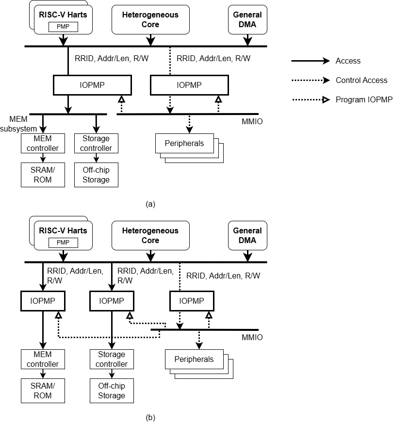

[[intro]]
== Introduction

This document outlines a mechanism to enhance platform security. In a platform, bus initiators can access target devices, similar to a RISC-V hart. Introducing I/O agents like DMA (Direct Memory Access) unit improves performance, but also exposes the system to vulnerabilities such as DMA attacks. In the RISC-V ecosystem, the PMP/ePMP cite:[PrivISA] provides a standard protection scheme for accesses from a RISC-V hart to the physical address space. However, there is no equivalent standard for safeguarding non-CPU initiators. The Physical Memory Protection Unit for Input/Output Devices (IOPMP) addresses this by controlling accesses issued by bus initiators.

IOPMP is a hardware component within a bus fabric to address situations where pure-software solutions are insufficient. For a RISC-V-based platform, a software solution typically involves a security monitor, a program running in M-mode that handles security-related requests. When a request for a DMA transfer is made, the security monitor checks if it meets all security rules and decides if it is legal. Only legal requests are executed. However, this check can be time-consuming, especially for complex requests like those from a GPU, which may involve running a program. Determining if a program violates access rules is generally an NP-hard problem. Even just considering average execution time, the latency is often unacceptable. A hardware component that can check accesses in real-time is a more practical solution. This document focuses on IOPMP. <<IOPMP_SYSTEM_POSITION>> conceptually demonstrates the integration of IOPMP into a system.

[#IOPMP_SYSTEM_POSITION]
.example integrations of IOPMP(s) in a system. {figure-caption} (a) shows a system deploying two IOPMPs. The IOPMPs take three inputs: RRID, the transaction type (read/write/instruction fetch), and the request range (address/len). {figure-caption} (b) shows a system deploying multiple IOPMPs. In this deployment, IOPMPs are at each resource, final destination.

Both IOMMU and IOPMP have their own useful applications, and they can coexist and collaborate within a bus matrix.
The Input-Output Memory Management Unit (IOMMU) cite:[IOMMU] is another hardware component in a bus matrix that translates a device's virtual address to a physical address in the bus matrix using one or more stages of page tables. 
It can operate in both trusted and untrusted environments and is typically used by a hypervisor or an OS. It offers excellent flexibility and reduces external memory fragmentation. However, it may not be ideal for security software running in M-mode because it requires relatively large memory and complex software compared to a typical security monitor. Additionally, the tables are usually stored in DRAM, which is outside the chip and may need external signal protection. For simple systems, this burden may be unaffordable. In contrast, the IOPMP consumes much less memory and stores rules inside the chip. IOPMP can be used by the security monitor to check access from devices controlled by other software, while IOMMU can be used by software with richer resources.
